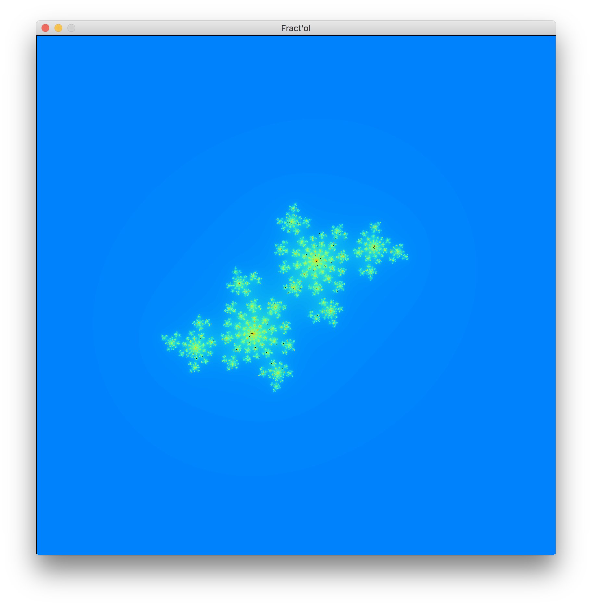
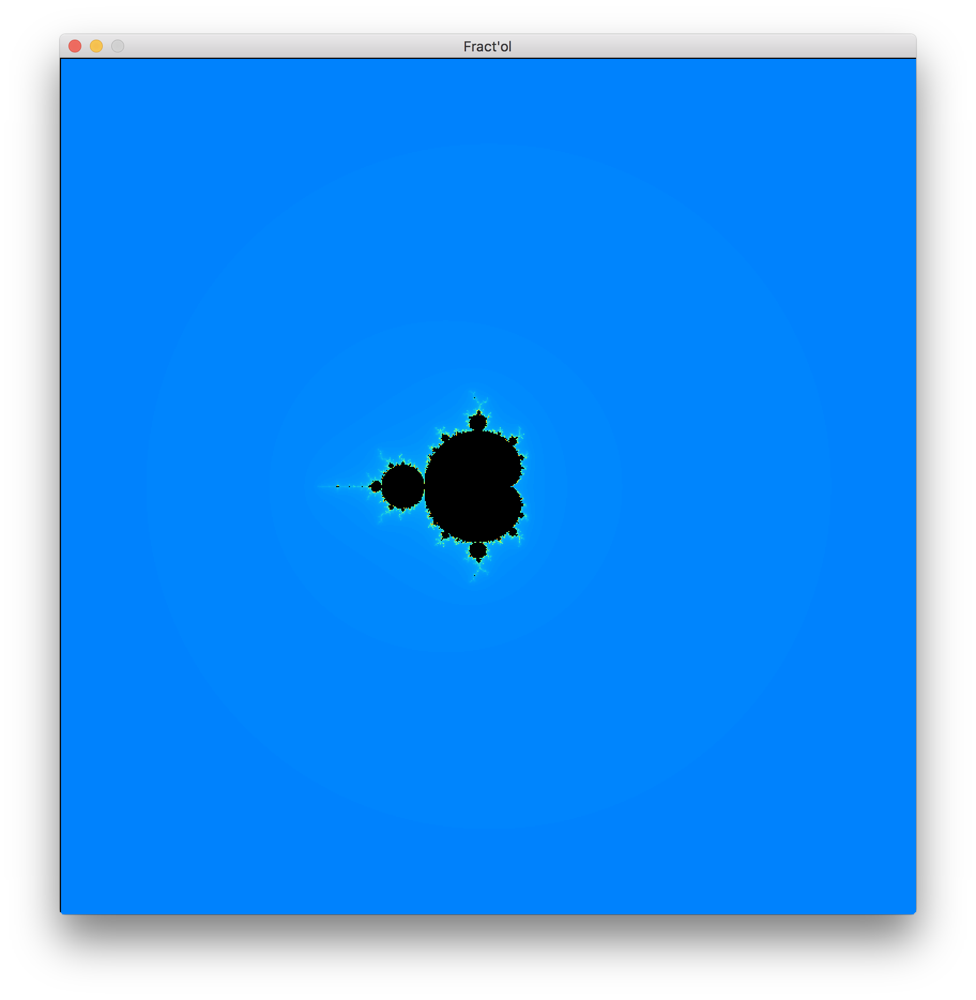
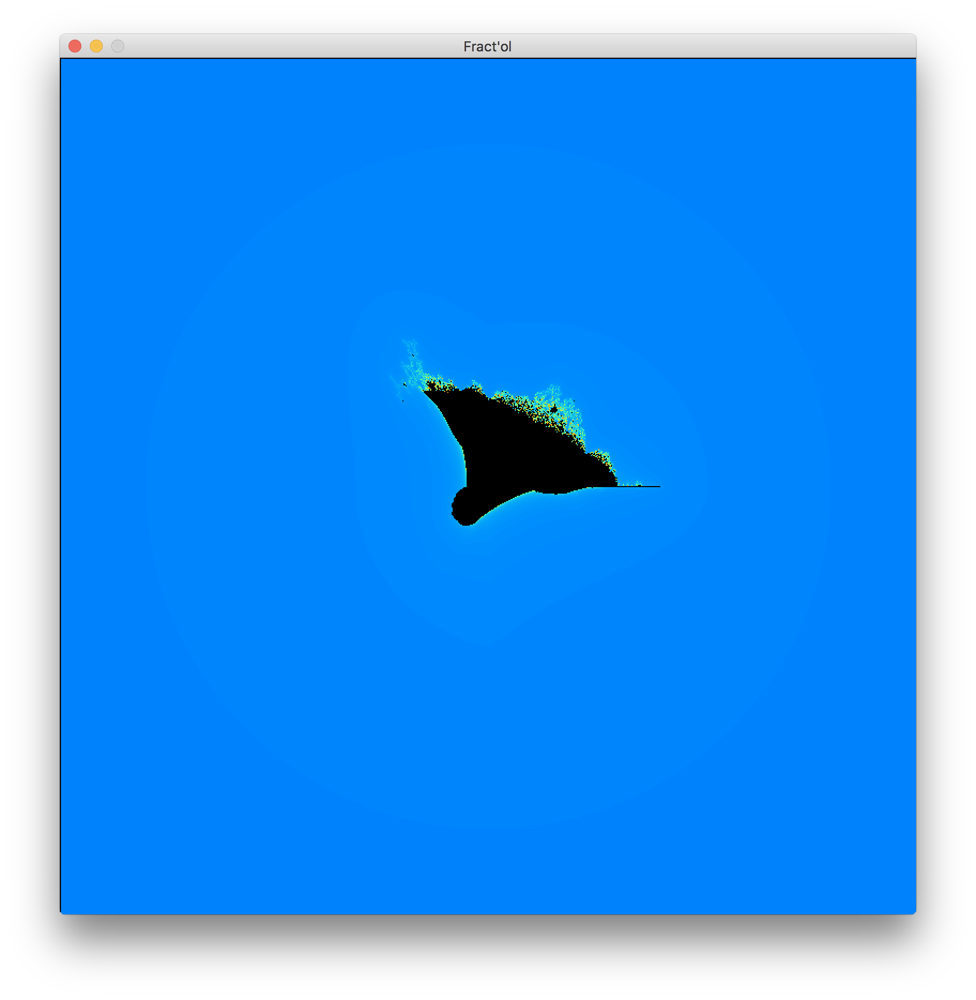
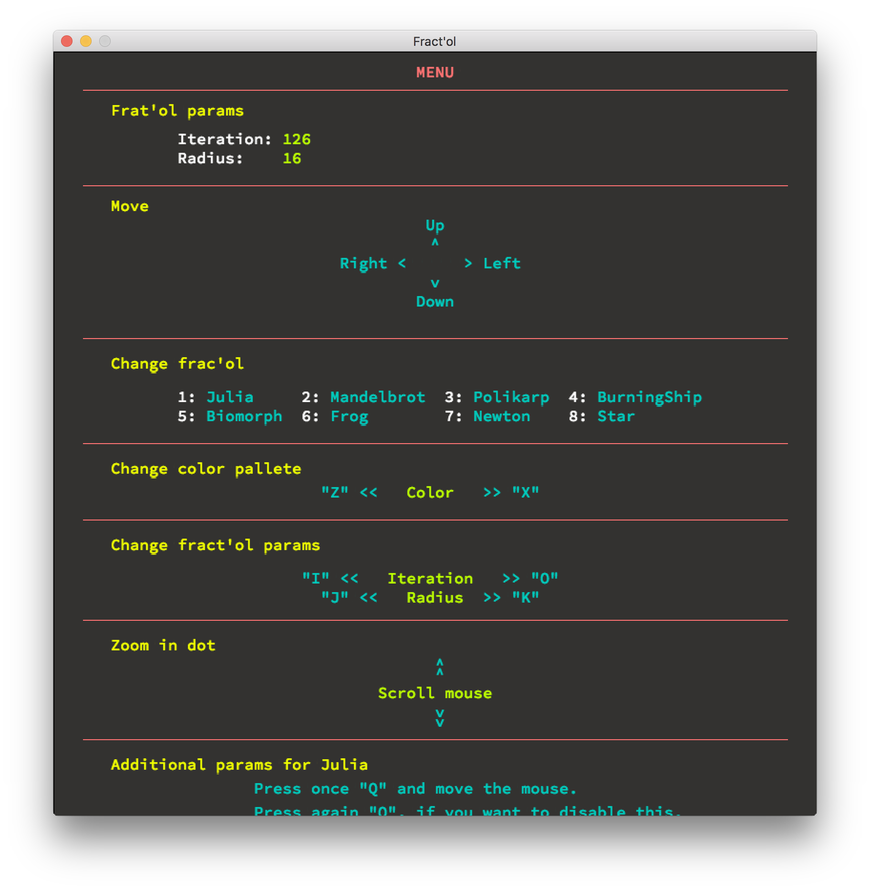

# **Fractol** #

### How it work? ###

* Run Makefile.
* ./fractol [name_fract] (Example: ./fractol Julia).

### Features ###

* Change a coefficient (if it's Julia).
* Zomming in dot.
* Change color scheme.
* Move fractol (left, right, up, down).
* Change number of iteration and radius.
* Change fractol (Press: 1...8)

### You can see following fractols ###

* **Julia**

In this case, you can change a coefficient (press 'Q' and move the mouse to left or right).
Press 'Q' again, if you want stop it. 

* **Mandelbrot**

* **Burning Ship**

* and other (Polikarp, Biomorph, Frog, Newton, Star).

### Also, you can use "Menu", if you want ###

Scroll it, if you need.